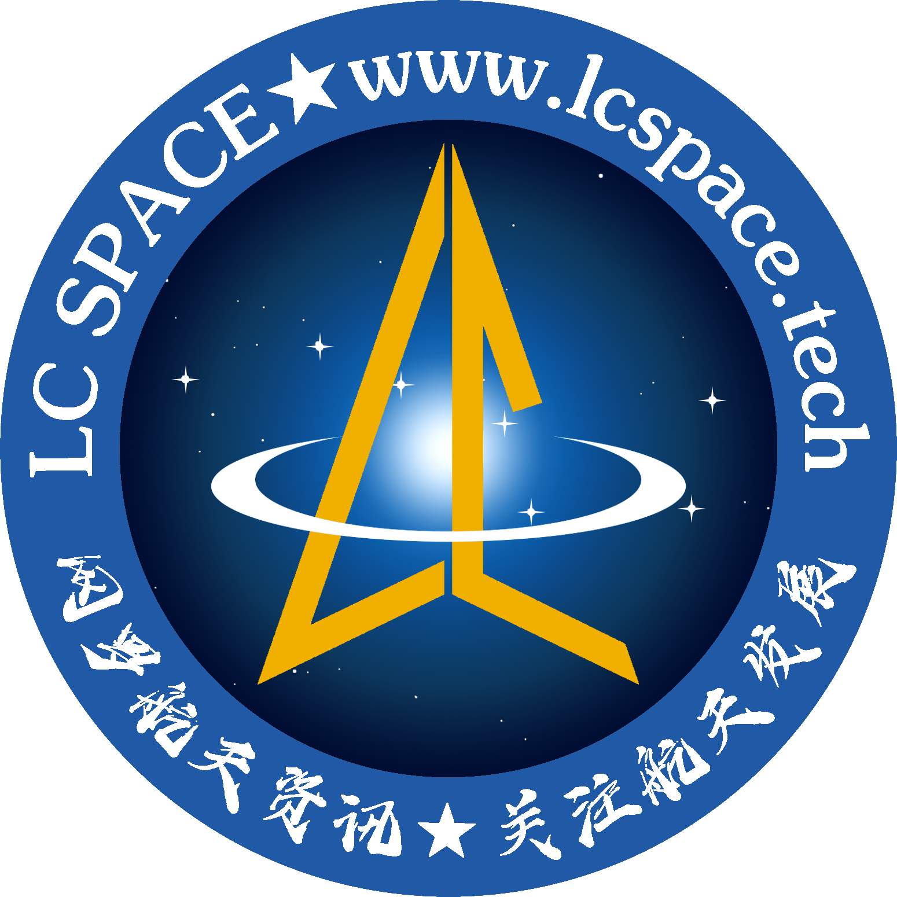

## &#x1F44B; 大家好，我是LC-space  

&#x1F680; 我是一名航天专业学生，同时也是一名航天爱好者！

&#x1F4BB; 我喜欢在空闲时间学习编程。

&#x1F525; 我也在经营自己的自媒体帐号，欢迎关注！

&#x1F310; 欢迎浏览[我的网站](http://www.lcspace.tech/)。

## &#x1F44B; Hi,I'm LC-space   

&#x1F680; I am an aerospace major student, but also an aerospace enthusiast!

&#x1F4BB; I like to learn programming in my spare time.

&#x1F525; I am also operating my own "We Media" account, welcome to pay attention!

&#x1F310; Welcome to [my website](http://www.lcspace.tech/).

## &#x1F600; Follow Me

    

